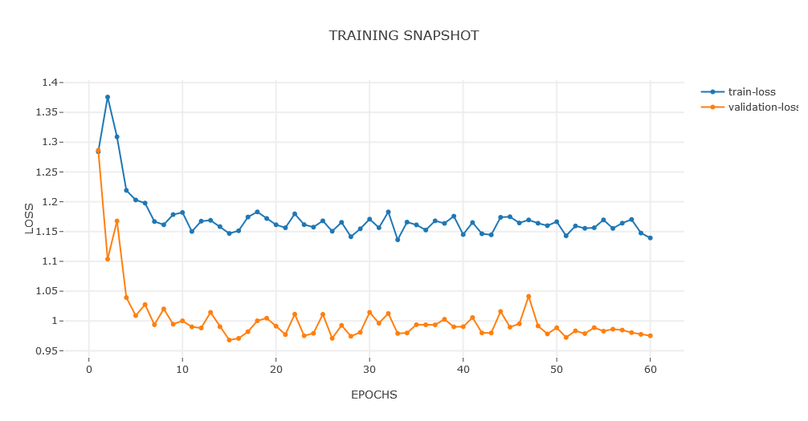

##### Experiment: 008


| hyp-params    | value                    |
| :------------ | ------------------------ |
| epochs        | 60                      |
| loss          | MSE |
| optimizer     | SGD                   |
| learning rate | 0.001                    |
| accuracy      | MSE            |
| momentum | 0.7 |

##### Model: 3D CNN

```
----------------------------------------------------------------
        Layer (type)               Output Shape         Param #
================================================================
            Conv3d-1        [-1, 5, 186, 5, 43]             655
            Conv3d-2         [-1, 1, 93, 2, 21]               6
           Dropout-3                  [-1, 460]               0
            Linear-4                    [-1, 3]           1,383
           Dropout-5                    [-1, 3]               0
           Sigmoid-6                    [-1, 3]               0
================================================================
Total params: 2,044
Trainable params: 2,044
Non-trainable params: 0
----------------------------------------------------------------
Input size (MB): 0.21
Forward/backward pass size (MB): 1.56
Params size (MB): 0.01
Estimated Total Size (MB): 1.78
----------------------------------------------------------------
```

##### Data

| value                                                        | param              |
| ------------------------------------------------------------ | :----------------- |
| 250                                                          | timesteps          |
| none                                                         | normalization      |
| only session 1 from [mindfulness/benchmark_tasks/fNIRS_Data](https://github.com/lmhirshf/mindfulness/tree/master/benchmark_tasks/data/fNIRS_Data) and [Experiments/Experiment7000/](https://github.com/lmhirshf/Experiments/Experiment7000/) | source experiments |
| regression; default3                                         | label type         |
| [ wm, a, v ] => [off = 0, low = 1, high = 2]                 | label config       |

##### Training



```
Epoch   Train Loss      Validation Loss
0       1.28396         1.28639
1       1.37570         1.10381
2       1.30898         1.16773
3       1.21913         1.03934
4       1.20300         1.00902
5       1.19773         1.02750
6       1.16689         0.99373
7       1.16147         1.02024
8       1.17851         0.99454
9       1.18204         1.00024
10      1.15013         0.99012
11      1.16741         0.98825
12      1.16889         1.01450
13      1.15833         0.99039
14      1.14683         0.96804
15      1.15138         0.97079
16      1.17442         0.98203
17      1.18304         1.00026
18      1.17195         1.00473
19      1.16143         0.99130
20      1.15637         0.97726
21      1.17980         1.01146
22      1.16162         0.97519
23      1.15743         0.97930
24      1.16803         1.01123
25      1.15053         0.97094
26      1.16553         0.99267
27      1.14131         0.97432
28      1.15464         0.98094
29      1.17082         1.01448
30      1.15645         0.99630
31      1.18295         1.01261
32      1.13621         0.97906
33      1.16585         0.97990
34      1.16126         0.99376
35      1.15257         0.99362
36      1.16799         0.99356
37      1.16375         1.00289
38      1.17584         0.99011
39      1.14504         0.99039
40      1.16522         1.00582
41      1.14637         0.98003
42      1.14453         0.97995
43      1.17395         1.01594
44      1.17491         0.98973
45      1.16446         0.99525
46      1.16956         1.04137
47      1.16395         0.99167
48      1.15992         0.97831
49      1.16652         0.98863
50      1.14285         0.97238
51      1.15942         0.98344
52      1.15550         0.97882
53      1.15643         0.98888
54      1.16963         0.98296
55      1.15535         0.98625
56      1.16412         0.98473
57      1.17034         0.98049
58      1.14757         0.97751
59      1.13934         0.97524
60      1.16388         0.97920
```

##### Observations

1. lowest accuracy so far. check plots for overfit
