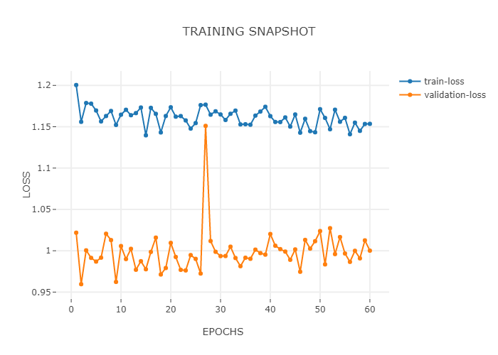

##### Experiment: 009


| hyp-params    | value                    |
| :------------ | ------------------------ |
| epochs        | 60                      |
| loss          | MSE |
| optimizer     | SGD                   |
| learning rate | 0.001                    |
| accuracy      | MSE            |
| momentum | 0.7 |

##### Model: 3D CNN

```
----------------------------------------------------------------
        Layer (type)               Output Shape         Param #
================================================================
            Conv3d-1        [-1, 5, 186, 5, 43]             655
       BatchNorm3d-2        [-1, 5, 186, 5, 43]              10
            Conv3d-3         [-1, 1, 93, 2, 21]               6
           Dropout-4                  [-1, 460]               0
            Linear-5                    [-1, 3]           1,383
           Dropout-6                    [-1, 3]               0
           Sigmoid-7                    [-1, 3]               0
================================================================
Total params: 2,054
Trainable params: 2,054
Non-trainable params: 0
----------------------------------------------------------------
Input size (MB): 0.21
Forward/backward pass size (MB): 3.08
Params size (MB): 0.01
Estimated Total Size (MB): 3.30
----------------------------------------------------------------
```

##### Data

| value                                                        | param              |
| ------------------------------------------------------------ | :----------------- |
| 250                                                          | timesteps          |
| none                                                         | normalization      |
| only session 1 from [mindfulness/benchmark_tasks/fNIRS_Data](https://github.com/lmhirshf/mindfulness/tree/master/benchmark_tasks/data/fNIRS_Data) and [Experiments/Experiment7000/](https://github.com/lmhirshf/Experiments/Experiment7000/) | source experiments |
| regression; default3                                         | label type         |
| [ wm, a, v ] => [off = 0, low = 1, high = 2]                 | label config       |
| 5x44                                                         | Shape              |

##### Training



```
Epoch   Train Loss      Validation Loss
0       1.20046         1.02183
1       1.15592         0.95957
2       1.17870         1.00049
3       1.17792         0.99140
4       1.16965         0.98693
5       1.15643         0.99164
6       1.16295         1.02059
7       1.16908         1.01293
8       1.15219         0.96233
9       1.16455         1.00568
10      1.17052         0.98994
11      1.16395         1.00233
12      1.16648         0.97703
13      1.17325         0.98736
14      1.13963         0.97763
15      1.17287         0.99856
16      1.16559         1.01588
17      1.14311         0.97129
18      1.16297         0.97913
19      1.17354         1.00951
20      1.16221         0.99251
21      1.16290         0.97691
22      1.15764         0.97620
23      1.14777         0.99478
24      1.15442         0.99018
25      1.17616         0.97245
26      1.17671         1.15103
27      1.16460         1.01177
28      1.16867         0.99874
29      1.16486         0.99357
30      1.15817         0.99363
31      1.16567         1.00492
32      1.16952         0.99124
33      1.15280         0.98134
34      1.15302         0.99157
35      1.15243         0.99028
36      1.16346         1.00134
37      1.16836         0.99719
38      1.17413         0.99530
39      1.16284         1.02024
40      1.15576         1.00610
41      1.15565         1.00198
42      1.16127         0.99900
43      1.15020         0.98906
44      1.16484         1.00163
45      1.14280         0.97458
46      1.15962         1.01311
47      1.14465         1.00258
48      1.14332         1.01156
49      1.17121         1.02383
50      1.16066         0.98351
51      1.14697         1.02730
52      1.17058         0.99594
53      1.15602         1.01657
54      1.16075         0.99669
55      1.14095         0.98655
56      1.15494         0.99996
57      1.14501         0.99080
58      1.15336         1.01253
59      1.15350         1.00013
60      1.15865         1.01952
```

##### Observations

1.
