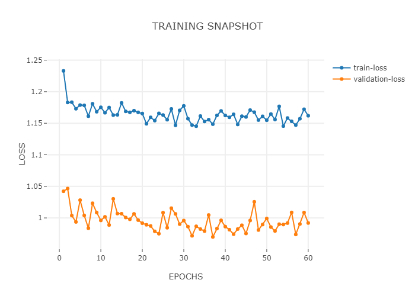

##### Experiment: 010


| hyp-params    | value                    |
| :------------ | ------------------------ |
| epochs        | 60                      |
| loss          | MSE |
| optimizer     | SGD                   |
| learning rate | 0.001                    |
| accuracy      | MSE            |
| momentum | 0.7 |

##### Model: 3D CNN

```
----------------------------------------------------------------
        Layer (type)               Output Shape         Param #
================================================================
            Conv3d-1        [-1, 5, 186, 5, 43]             655
       BatchNorm3d-2         [-1, 5, 93, 2, 21]              10
            Conv3d-3         [-1, 1, 93, 2, 21]               6
           Dropout-4                  [-1, 460]               0
            Linear-5                    [-1, 3]           1,383
           Dropout-6                    [-1, 3]               0
           Sigmoid-7                    [-1, 3]               0
================================================================
Total params: 2,054
Trainable params: 2,054
Non-trainable params: 0
----------------------------------------------------------------
Input size (MB): 0.21
Forward/backward pass size (MB): 1.71
Params size (MB): 0.01
Estimated Total Size (MB): 1.93
----------------------------------------------------------------
```

##### Data

| value                                                        | param              |
| ------------------------------------------------------------ | :----------------- |
| 250                                                          | timesteps          |
| none                                                         | normalization      |
| only session 1 from [mindfulness/benchmark_tasks/fNIRS_Data](https://github.com/lmhirshf/mindfulness/tree/master/benchmark_tasks/data/fNIRS_Data) and [Experiments/Experiment7000/](https://github.com/lmhirshf/Experiments/Experiment7000/) | source experiments |
| regression; default3                                         | label type         |
| [ wm, a, v ] => [off = 0, low = 1, high = 2]                 | label config       |
| 5x44                                                         | Shape              |

##### Training



```
Epoch   Train Loss      Validation Loss
0       1.23295         1.04221
1       1.18290         1.04656
2       1.18334         1.00373
3       1.17296         0.99362
4       1.17877         1.02814
5       1.17838         1.00388
6       1.16118         0.98371
7       1.18088         1.02321
8       1.16822         1.00851
9       1.17526         0.99607
10      1.16661         1.00172
11      1.17488         0.98873
12      1.16290         1.03018
13      1.16333         1.00686
14      1.18221         1.00666
15      1.16878         1.00063
16      1.16729         0.99782
17      1.16990         1.00640
18      1.16728         0.99650
19      1.16539         0.99166
20      1.14920         0.98912
21      1.15934         0.98720
22      1.15417         0.97876
23      1.16561         0.97494
24      1.16302         1.00839
25      1.15559         0.98440
26      1.17267         1.01543
27      1.14675         1.00637
28      1.17040         0.99010
29      1.17748         0.99584
30      1.15725         0.98619
31      1.14707         0.97167
32      1.14531         0.98672
33      1.16140         0.98233
34      1.15278         0.97916
35      1.15567         1.00461
36      1.14849         0.96984
37      1.16245         0.98316
38      1.16949         0.99618
39      1.16238         0.98623
40      1.15938         0.98132
41      1.16416         0.97420
42      1.14806         0.98234
43      1.16117         0.98838
44      1.15994         0.97531
45      1.17084         0.99593
46      1.16753         1.02551
47      1.15502         0.98080
48      1.16095         0.98946
49      1.15478         0.99908
50      1.16457         0.98547
51      1.15591         0.97928
52      1.17676         0.99004
53      1.14547         0.98952
54      1.15826         0.99180
55      1.15306         1.00867
56      1.14711         0.97376
57      1.15719         0.99034
58      1.17214         1.00854
59      1.16187         0.99195
60      1.15944         0.97160
```

##### Observations

1.
