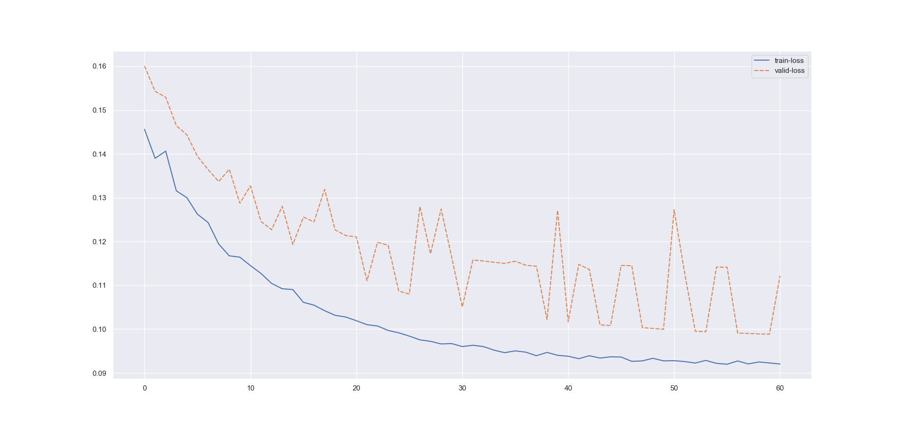

##### Experiment: 010


| hyp-params    | value                    |
| :------------ | ------------------------ |
| epochs        | 60                      |
| loss          | cross entropy loss |
| optimizer     | SGD                   |
| learning rate | 0.001                    |
| accuracy      | negative log liklihood |
| momentum | 0.7 |

##### Model: 3D CNN

```
----------------------------------------------------------------
        Layer (type)               Output Shape         Param #
================================================================
            Conv3d-1        [-1, 5, 186, 5, 10]           1,305
       BatchNorm3d-2          [-1, 5, 93, 2, 5]              10
           Dropout-3          [-1, 5, 93, 2, 5]               0
            Conv3d-4         [-1, 10, 93, 2, 5]              60
       BatchNorm3d-5         [-1, 10, 46, 1, 2]              20
           Dropout-6         [-1, 10, 46, 1, 2]               0
            Conv3d-7          [-1, 5, 46, 1, 2]              55
       BatchNorm3d-8          [-1, 5, 23, 1, 1]              10
           Dropout-9          [-1, 5, 23, 1, 1]               0
           Conv3d-10          [-1, 1, 23, 1, 1]               6
      BatchNorm3d-11          [-1, 1, 11, 1, 1]               2
          Dropout-12          [-1, 1, 11, 1, 1]               0
          Dropout-13                   [-1, 11]               0
           Linear-14                    [-1, 3]              36
================================================================
Total params: 1,504
Trainable params: 1,504
Non-trainable params: 0
----------------------------------------------------------------
Input size (MB): 0.10
Forward/backward pass size (MB): 0.52
Params size (MB): 0.01
Estimated Total Size (MB): 0.63
----------------------------------------------------------------
```

##### Data

| param              | value                                                        |
| :----------------- | ------------------------------------------------------------ |
| timesteps          | 250                                                          |
| normalization      | none                                                         |
| source experiments | only session 1 from [mindfulness/benchmark_tasks/fNIRS_Data](https://github.com/lmhirshf/mindfulness/tree/master/benchmark_tasks/data/fNIRS_Data) and [Experiments/Experiment7000/](https://github.com/lmhirshf/Experiments/Experiment7000/) |
| label type         | regression; default3                                         |
| label config       | [ wm ] => [off = 0, low = 1, high = 2]                       |
| Shape              | 5x22                                                         |

##### Training



```
Epoch   Train Loss      Validation Loss
0       0.14560         0.16005
1       0.13900         0.15429
2       0.14063         0.15292
3       0.13158         0.14644
4       0.13000         0.14435
5       0.12622         0.13943
6       0.12435         0.13642
7       0.11944         0.13369
8       0.11674         0.13648
9       0.11643         0.12875
10      0.11451         0.13271
11      0.11271         0.12457
12      0.11044         0.12270
13      0.10923         0.12805
14      0.10904         0.11931
15      0.10613         0.12557
16      0.10549         0.12449
17      0.10422         0.13190
18      0.10316         0.12264
19      0.10278         0.12136
20      0.10194         0.12106
21      0.10103         0.11105
22      0.10072         0.11982
23      0.09972         0.11916
24      0.09917         0.10869
25      0.09842         0.10802
26      0.09756         0.12797
27      0.09723         0.11722
28      0.09663         0.12742
29      0.09672         0.11643
30      0.09603         0.10507
31      0.09633         0.11579
32      0.09603         0.11556
33      0.09521         0.11528
34      0.09464         0.11500
35      0.09505         0.11551
36      0.09476         0.11459
37      0.09395         0.11437
38      0.09470         0.10219
39      0.09404         0.12712
40      0.09382         0.10168
41      0.09327         0.11479
42      0.09394         0.11361
43      0.09341         0.10099
44      0.09369         0.10082
45      0.09364         0.11454
46      0.09266         0.11450
47      0.09276         0.10035
48      0.09336         0.10017
49      0.09276         0.09997
50      0.09281         0.12727
51      0.09261         0.11272
52      0.09228         0.09953
53      0.09288         0.09943
54      0.09220         0.11417
55      0.09200         0.11415
56      0.09274         0.09910
57      0.09208         0.09903
58      0.09252         0.09891
59      0.09230         0.09886
60      0.09205         0.11217
```

##### Observations

1. Testing concluded that model is biased towards higher volume of input class.