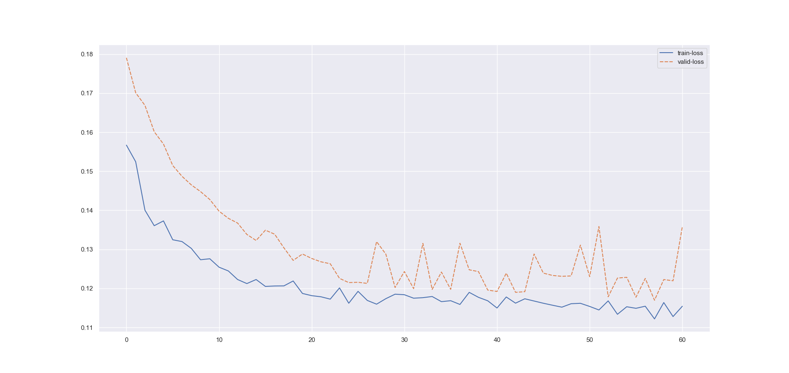

##### Experiment: 010


| hyp-params    | value                    |
| :------------ | ------------------------ |
| epochs        | 60                      |
| loss          | cross entropy loss |
| optimizer     | SGD                   |
| learning rate | 0.001                    |
| accuracy      | negative log liklihood |
| momentum | 0.7 |

##### Model: 3D CNN

```
----------------------------------------------------------------
        Layer (type)               Output Shape         Param #
================================================================
            Conv3d-1        [-1, 5, 186, 5, 10]           1,305
       BatchNorm3d-2          [-1, 5, 93, 2, 5]              10
           Dropout-3          [-1, 5, 93, 2, 5]               0
            Conv3d-4         [-1, 10, 93, 2, 5]              60
       BatchNorm3d-5         [-1, 10, 46, 1, 2]              20
           Dropout-6         [-1, 10, 46, 1, 2]               0
            Conv3d-7          [-1, 5, 46, 1, 2]              55
       BatchNorm3d-8          [-1, 5, 23, 1, 1]              10
           Dropout-9          [-1, 5, 23, 1, 1]               0
           Conv3d-10          [-1, 1, 23, 1, 1]               6
      BatchNorm3d-11          [-1, 1, 11, 1, 1]               2
          Dropout-12          [-1, 1, 11, 1, 1]               0
          Dropout-13                   [-1, 11]               0
           Linear-14                    [-1, 3]              36
================================================================
Total params: 1,504
Trainable params: 1,504
Non-trainable params: 0
----------------------------------------------------------------
Input size (MB): 0.10
Forward/backward pass size (MB): 0.52
Params size (MB): 0.01
Estimated Total Size (MB): 0.63
----------------------------------------------------------------
```

##### Data

| value                                                        | param              |
| ------------------------------------------------------------ | :----------------- |
| 250                                                          | timesteps          |
| none                                                         | normalization      |
| only session 1 from [mindfulness/benchmark_tasks/fNIRS_Data](https://github.com/lmhirshf/mindfulness/tree/master/benchmark_tasks/data/fNIRS_Data) and [Experiments/Experiment7000/](https://github.com/lmhirshf/Experiments/Experiment7000/) | source experiments |
| regression; default3                                         | label type         |
| [ vl ] => [off = 0, low = 1, high = 2]                       | label config       |
| 5x22                                                         | Shape              |

##### Training



```
Epoch   Train Loss      Validation Loss
0       0.15670         0.17907
1       0.15244         0.17012
2       0.14003         0.16689
3       0.13606         0.16014
4       0.13729         0.15697
5       0.13246         0.15148
6       0.13200         0.14871
7       0.13026         0.14652
8       0.12734         0.14480
9       0.12759         0.14277
10      0.12543         0.13978
11      0.12447         0.13796
12      0.12228         0.13674
13      0.12124         0.13383
14      0.12227         0.13228
15      0.12051         0.13492
16      0.12062         0.13388
17      0.12064         0.13039
18      0.12190         0.12717
19      0.11871         0.12881
20      0.11814         0.12767
21      0.11785         0.12681
22      0.11725         0.12632
23      0.12013         0.12257
24      0.11620         0.12149
25      0.11925         0.12157
26      0.11692         0.12128
27      0.11596         0.13198
28      0.11737         0.12879
29      0.11852         0.12022
30      0.11838         0.12432
31      0.11749         0.11994
32      0.11763         0.13154
33      0.11792         0.11973
34      0.11660         0.12419
35      0.11685         0.11974
36      0.11589         0.13158
37      0.11898         0.12477
38      0.11771         0.12430
39      0.11683         0.11957
40      0.11498         0.11921
41      0.11780         0.12391
42      0.11622         0.11899
43      0.11734         0.11916
44      0.11677         0.12881
45      0.11620         0.12391
46      0.11568         0.12332
47      0.11519         0.12309
48      0.11607         0.12319
49      0.11618         0.13109
50      0.11538         0.12300
51      0.11447         0.13585
52      0.11680         0.11784
53      0.11336         0.12265
54      0.11530         0.12284
55      0.11490         0.11774
56      0.11544         0.12256
57      0.11218         0.11697
58      0.11637         0.12227
59      0.11278         0.12195
60      0.11542         0.13578
```

##### Observations

1. Same as 011
