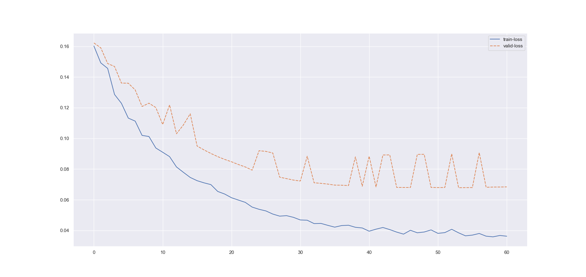

##### Experiment: 010


| hyp-params    | value                    |
| :------------ | ------------------------ |
| epochs        | 60                      |
| loss          | cross entropy loss |
| optimizer     | SGD                   |
| learning rate | 0.001                    |
| accuracy      | negative log liklihood |
| momentum | 0.7 |

##### Model: 3D CNN

```
----------------------------------------------------------------
        Layer (type)               Output Shape         Param #
================================================================
            Conv3d-1        [-1, 5, 186, 5, 10]           1,305
       BatchNorm3d-2          [-1, 5, 93, 2, 5]              10
           Dropout-3          [-1, 5, 93, 2, 5]               0
            Conv3d-4         [-1, 10, 93, 2, 5]              60
       BatchNorm3d-5         [-1, 10, 46, 1, 2]              20
           Dropout-6         [-1, 10, 46, 1, 2]               0
            Conv3d-7          [-1, 5, 46, 1, 2]              55
       BatchNorm3d-8          [-1, 5, 23, 1, 1]              10
           Dropout-9          [-1, 5, 23, 1, 1]               0
           Conv3d-10          [-1, 1, 23, 1, 1]               6
      BatchNorm3d-11          [-1, 1, 11, 1, 1]               2
          Dropout-12          [-1, 1, 11, 1, 1]               0
          Dropout-13                   [-1, 11]               0
           Linear-14                    [-1, 3]              36
================================================================
Total params: 1,504
Trainable params: 1,504
Non-trainable params: 0
----------------------------------------------------------------
Input size (MB): 0.10
Forward/backward pass size (MB): 0.52
Params size (MB): 0.01
Estimated Total Size (MB): 0.63
----------------------------------------------------------------
```

##### Data

| param              | value                                                        |
| :----------------- | ------------------------------------------------------------ |
| timesteps          | 250                                                          |
| normalization      | none                                                         |
| source experiments | only session 1 from [mindfulness/benchmark_tasks/fNIRS_Data](https://github.com/lmhirshf/mindfulness/tree/master/benchmark_tasks/data/fNIRS_Data) and [Experiments/Experiment7000/](https://github.com/lmhirshf/Experiments/Experiment7000/) |
| label type         | regression; default3                                         |
| label config       | [ al ] => [off = 0, low = 1, high = 2]                       |
| Shape              | 5x22                                                         |

##### Training



```
Epoch   Train Loss      Validation Loss
0       0.16021         0.16222
1       0.14921         0.15902
2       0.14562         0.14880
3       0.12861         0.14687
4       0.12287         0.13605
5       0.11321         0.13597
6       0.11125         0.13162
7       0.10195         0.12080
8       0.10122         0.12296
9       0.09373         0.12010
10      0.09096         0.10906
11      0.08810         0.12182
12      0.08138         0.10301
13      0.07790         0.10872
14      0.07454         0.11607
15      0.07243         0.09499
16      0.07103         0.09250
17      0.06988         0.09018
18      0.06540         0.08810
19      0.06374         0.08631
20      0.06131         0.08475
21      0.05980         0.08297
22      0.05830         0.08139
23      0.05522         0.07929
24      0.05377         0.09196
25      0.05271         0.09153
26      0.05067         0.09045
27      0.04932         0.07471
28      0.04963         0.07377
29      0.04853         0.07282
30      0.04683         0.07221
31      0.04666         0.08838
32      0.04447         0.07107
33      0.04458         0.07069
34      0.04331         0.07021
35      0.04214         0.06955
36      0.04317         0.06948
37      0.04339         0.06925
38      0.04205         0.08794
39      0.04160         0.06881
40      0.03950         0.08833
41      0.04082         0.06836
42      0.04192         0.08918
43      0.04054         0.08924
44      0.03892         0.06805
45      0.03759         0.06801
46      0.04010         0.06802
47      0.03846         0.08957
48      0.03897         0.08962
49      0.04034         0.06803
50      0.03809         0.06795
51      0.03857         0.06800
52      0.04074         0.08992
53      0.03844         0.06785
54      0.03648         0.06791
55      0.03695         0.06794
56      0.03802         0.09069
57      0.03626         0.06813
58      0.03583         0.06827
59      0.03672         0.06830
60      0.03623         0.06838
```

##### Observations

1. Same as 011
