#### Cross Validation Results

##### Accuracy vs. Convolution Time Window

Each of these values are the result of 10 fold cross validation with 29 participants, leaving 6 participants out at every validation run. Dataset for each of the 10 fold CV runs across time window values is the same for consistency in results. The **task performance** cut-off for these validation runs for **90%** and **10%** of the dataset is  **0.9** and **0.6** respectively. Data is **normalized across participants**.

#### K = 1

| Convolution Window Length | Binary CM                                                    | Binary % | Ternary CM | Ternary % | Model Path (BINARY)                                          | Model Path (TERNARY) |
| ------------------------- | ------------------------------------------------------------ | -------- | ---------- | --------- | ------------------------------------------------------------ | -------------------- |
| 10                        |  | 75.0     |            |           | ./1/10/siamese-e-19-ts-1566849344.45986-a-75.0-l-0.008249113077918688.pth |                      |
| 50                        | 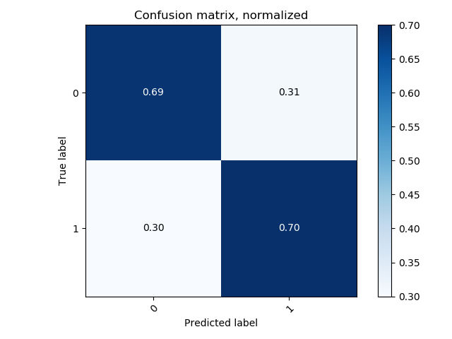 | 69.88    |            |           | ./1/50/siamese-e-29-ts-1566853802.7683074-a-69.44444444444444-l-0.008173115937660139.pth |                      |
| 100                       |  | 80.55    |            |           | ./1/100/siamese-e-29-ts-1566858266.1245084-a-80.55555555555556-l-0.008208596809456745.pth |                      |
| 150                       | 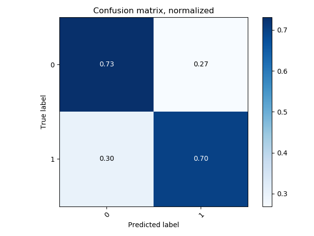 | 72.22    |            |           | ./1/150/siamese-e-9-ts-1566853510.0337257-a-72.22222222222223-l-0.008585652822007735.pth |                      |
| 200                       | 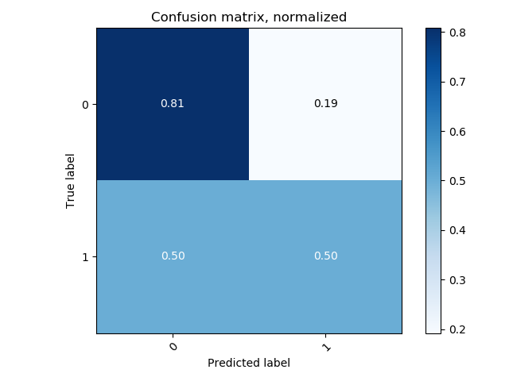 | 72.44    |            |           | ./1/200/siamese-e-26-ts-1566869407.023566-a-72.22222222222223-l-0.008068195172895988.pth |                      |
| 250                       | 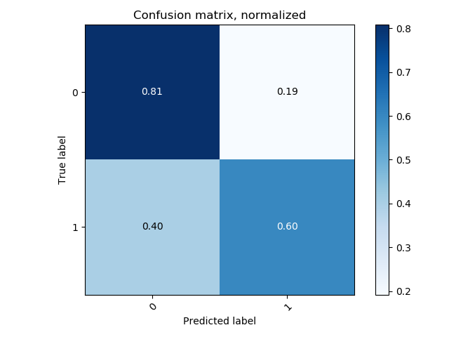 | 75       |            |           | ./1/250/siamese-e-11-ts-1566869654.0575867-a-75.0-l-0.00847354202841719.pth |                      |
| 300                       |  | 69.44    |            |           | ./1/300/siamese-e-17-ts-1566883154.9474852-a-69.44444444444444-l-0.008218318529427051.pth |                      |
| 350                       | 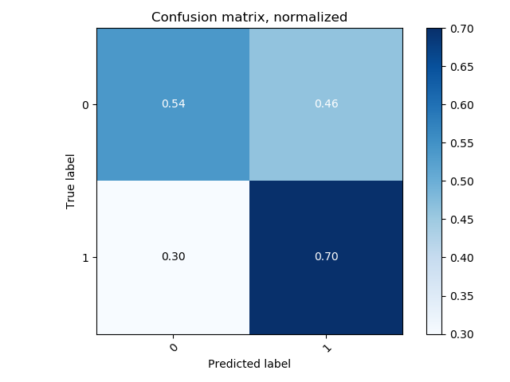 | 58.33    |            |           | ./1/350/siamese-e-17-ts-1566881341.3970919-a-58.333333333333336-l-0.008293059116850297.pth |                      |
| 400                       | 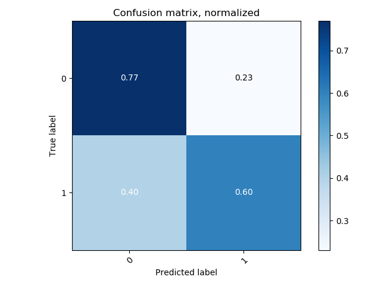 | 72.22    |            |           | ./1/400/siamese-e-30-ts-1566931235.3992617-a-72.22222222222223-l-0.008112365083148082.pth |                      |
| 450                       | 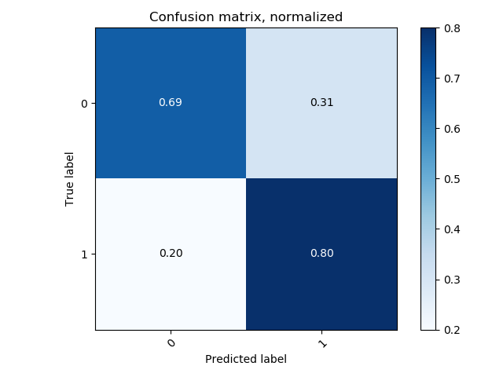 | 72.22    |            |           | ./1/450/siamese-e-11-ts-1566912795.3504364-a-72.22222222222223-l-0.008473367411643267.pth |                      |
| 500                       | 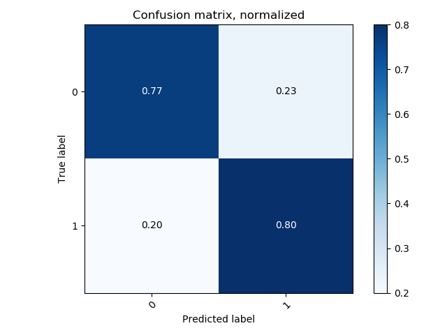 | 77.77    |            |           | ./1/500/siamese-e-22-ts-1566923888.297025-a-77.77777777777777-l-0.00815462057168285.pth |                      |

#### K = 2

| Convolution Window Length | Binary CM                                                    | Binary % | Ternary CM | Ternary % | Model Path (BINARY)                                          | Model Path (TERNARY) |
| ------------------------- | ------------------------------------------------------------ | -------- | ---------- | --------- | ------------------------------------------------------------ | -------------------- |
| 10                        |  | 81.20    |            |           | ./2/10/siamese-e-12-ts-1566955677.466846-a-71.05263157894737-l-0.008287634370874052.pth |                      |
| 50                        | 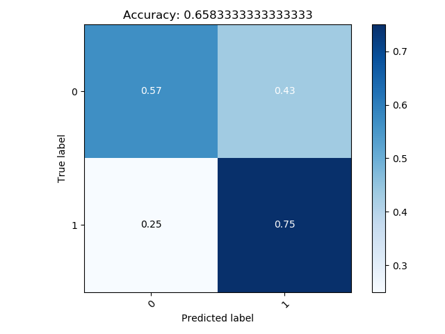 | 65.83    |            |           | ./2/50/siamese-e-6-ts-1566956489.6475399-a-60.526315789473685-l-0.008675201736288527.pth |                      |
| 100                       | 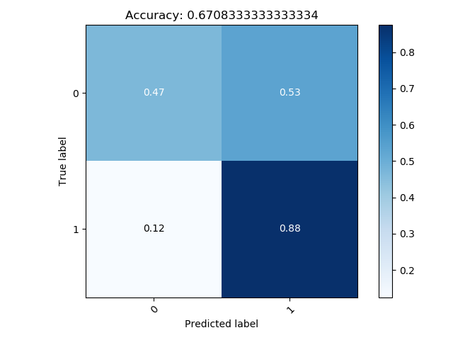 | 67.08    |            |           | ./2/100/siamese-e-25-ts-1566965667.273647-a-55.26315789473684-l-0.00815523963268489.pth |                      |
| 150                       |  | 73.75    |            |           | ./2/150/siamese-e-29-ts-1566973672.9477806-a-65.78947368421052-l-0.016555442616139372.pth |                      |
| 200                       | 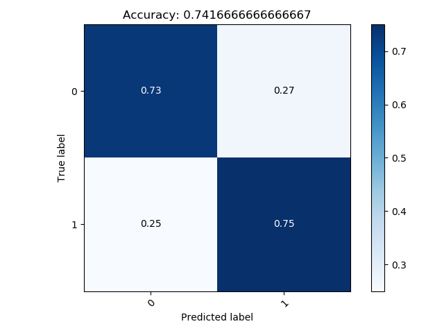 | 74.74    |            |           | ./2/200/siamese-e-2-ts-1566962932.591039-a-73.6842105263158-l-0.008495186737751308.pth |                      |
| 250                       | 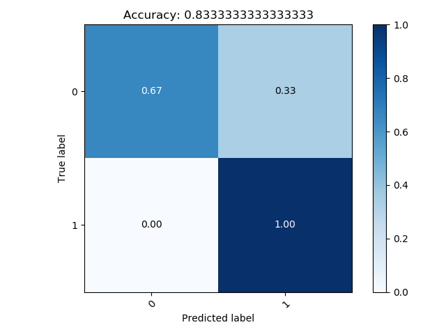 | 83.33    |            |           | ./2/250/siamese-e-23-ts-1566999888.630343-a-73.6842105263158-l-0.00816372228403614.pth |                      |
| 300                       |  | 77.08    |            |           | ./2/300/siamese-e-4-ts-1566981819.7637875-a-71.05263157894737-l-0.008732719199910555.pth |                      |
| 350                       | 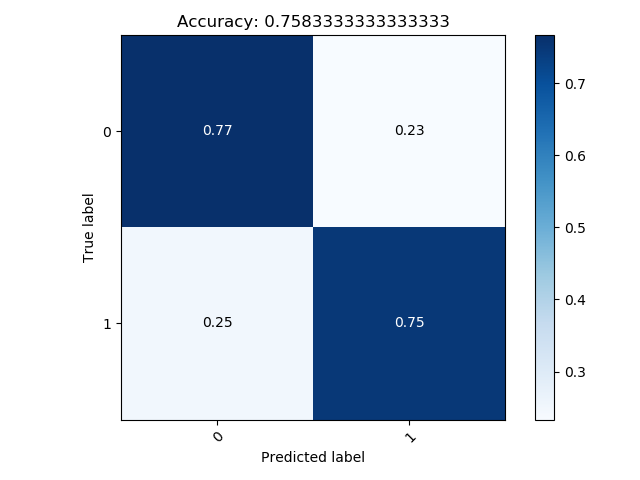 | 75.83    |            |           | ./2/350/siamese-e-5-ts-1566983687.923683-a-76.3157894736842-l-0.008647627396738692.pth |                      |
| 400                       |  | 78.33    |            |           | ./2/400/siamese-e-29-ts-1567047277.2749765-a-65.78947368421052-l-0.00808152701144349.pth |                      |
| 450                       |  | 75.41    |            |           | ./2/450/siamese-e-24-ts-1567056158.6001163-a-68.42105263157895-l-0.008154237870484183.pth.png |                      |
| 500                       |  | 73.75    |            |           | ./2/500/siamese-e-21-ts-1567059064.939918-a-65.78947368421052-l-0.008190723011550839.pth |                      |

