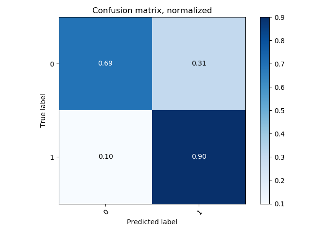
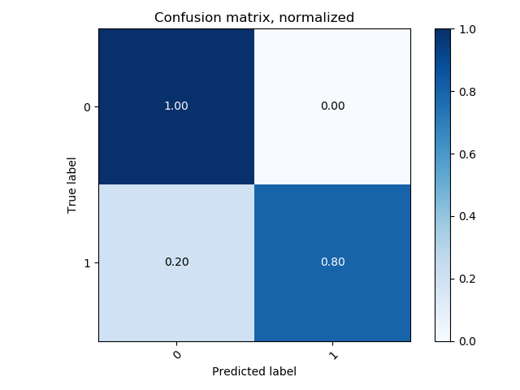
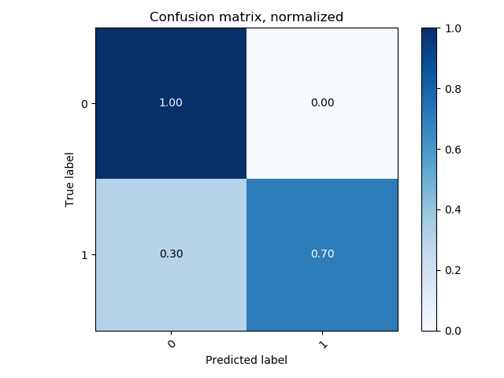

#### Cross Validation Results

##### Accuracy vs. Convolution Time Window

Each of these values are the result of 10 fold cross validation with 29 participants, leaving 6 participants out at every validation run. Dataset for each of the 10 fold CV runs across time window values is the same for consistency in results. The **task performance** cut-off for these validation runs for **90%** and **10%** of the dataset is  **0.9** and **0.6** respectively. Data is **normalized across participants**.

#### K = 1

| Convolution Window Length | Binary CM                                                    | Binary % | Ternary CM | Ternary % | Model Path (BINARY)                                          | Model Path (TERNARY) |
| ------------------------- | ------------------------------------------------------------ | -------- | ---------- | --------- | ------------------------------------------------------------ | -------------------- |
| 10                        |  | 75.0%    |            |           | ./1/10/siamese-e-19-ts-1566849344.45986-a-75.0-l-0.008249113077918688.pth |                      |
| 250                       |  | 63.88    |            |           | ./1/250/model-siamese-epoch-7-ts-1566680749.9065804.pth      |                      |
| 150                       |  | 61.11    |            |           | ./1/150/model-siamese-epoch-5-ts-1566768499.982043.pth       |                      |

