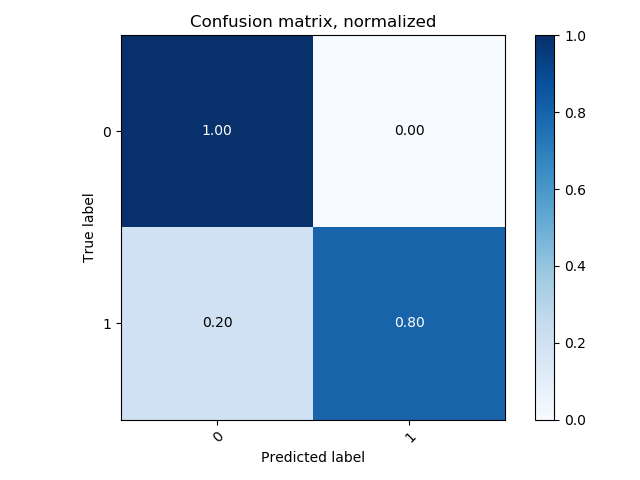

#### Cross Validation Results

##### Accuracy vs. Convolution Time Window

Each of these values are the result of 10 fold cross validation with 29 participants, leaving 6 participants out at every validation run. Dataset for each of the 10 fold CV runs across time window values is the same for consistency in results. The **task performance** cut-off for these validation runs for **90%** and **10%** of the dataset is  **0.9** and **0.6** respectively. Data is **normalized across participants**.

#### K = 1

| Convolution Window Length | Binary CM                                                    | Binary % | Ternary CM | Ternary % | Model Path (BINARY)                                     | Model Path (TERNARY) |
| ------------------------- | ------------------------------------------------------------ | -------- | ---------- | --------- | ------------------------------------------------------- | -------------------- |
| 300                       |  | 66.66%   |            |           | ./1/300/model-siamese-epoch-4-ts-1566664607.9168901.pth |                      |
| 250                       |                                                              |          |            |           |                                                         |                      |
| 10                        |                                                              |          |            |           |                                                         |                      |

