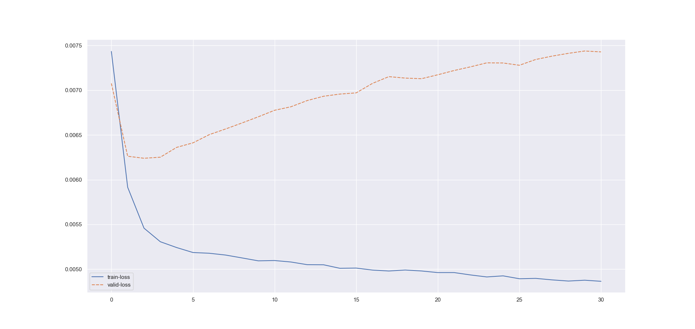

##### Experiment: 001


| hyp-params    | value                    |
| :------------ | ------------------------ |
| epochs        | 30                      |
| loss          | cross entropy loss |
| optimizer     | Adam                   |
| learning rate | 0.001                    |
| accuracy      | negative log liklihood |
| momentum | 0.7 |

##### Data

| param              | value                                                        |
| :----------------- | ------------------------------------------------------------ |
| timesteps          | 55 (5:60)                                                          |
| normalization      | none                                                         |
| source experiments | only session 1 from [mindfulness/benchmark_tasks/fNIRS_Data](https://github.com/lmhirshf/mindfulness/tree/master/benchmark_tasks/data/fNIRS_Data) and [Experiments/Experiment7000/](https://github.com/lmhirshf/Experiments/Experiment7000/) |
| label type         | regression; default3                                         |
| label config       | [ binary ] => [cr = 0, others = 1]                       |
| Shape              | 2x5x11                                                         |

##### Training



```
Epoch   Train Loss      Validation Loss Validation Acc
0       0.00743         0.00708         68.696
1       0.00591         0.00626         68.792
2       0.00546         0.00624         68.986
3       0.00531         0.00625         68.986
4       0.00524         0.00636         69.275
5       0.00519         0.00641         69.179
6       0.00518         0.00650         68.502
7       0.00516         0.00657         66.377
8       0.00513         0.00663         63.671
9       0.00509         0.00670         62.512
10      0.00510         0.00678         62.512
11      0.00508         0.00681         62.319
12      0.00505         0.00688         62.126
13      0.00505         0.00693         62.126
14      0.00501         0.00696         62.029
15      0.00501         0.00697         61.932
16      0.00499         0.00708         62.126
17      0.00498         0.00715         61.932
18      0.00499         0.00714         61.643
19      0.00498         0.00713         61.643
20      0.00496         0.00717         61.449
21      0.00496         0.00722         61.449
22      0.00494         0.00726         61.643
23      0.00491         0.00731         61.546
24      0.00493         0.00730         61.353
25      0.00489         0.00728         61.353
26      0.00490         0.00734         60.966
27      0.00488         0.00738         61.643
28      0.00487         0.00741         61.256
29      0.00488         0.00744         61.256
30      0.00486         0.00743         61.063
```

##### Observations

1. Simple model. it works
