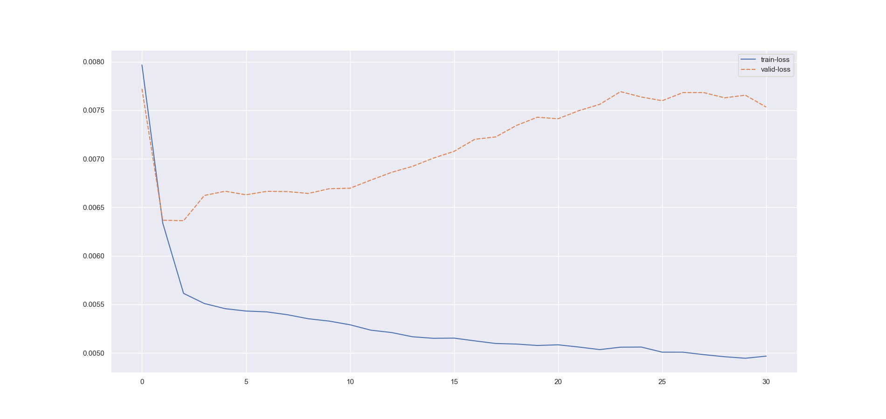

##### Experiment: 001


| hyp-params    | value                    |
| :------------ | ------------------------ |
| epochs        | 30                      |
| loss          | cross entropy loss |
| optimizer     | Adam                   |
| learning rate | 0.001                    |
| accuracy      | negative log liklihood |
| momentum | 0.7 |

##### Data

| param              | value                                                        |
| :----------------- | ------------------------------------------------------------ |
| timesteps          | 55 (5:60)                                                          |
| normalization      | none                                                         |
| source experiments | only session 1 from [mindfulness/benchmark_tasks/fNIRS_Data](https://github.com/lmhirshf/mindfulness/tree/master/benchmark_tasks/data/fNIRS_Data) and [Experiments/Experiment7000/](https://github.com/lmhirshf/Experiments/Experiment7000/) |
| label type         | regression; default3                                         |
| label config       | [ wm ] => [off = 0, low = 1, high = 2]                       |
| Shape              | 2x5x11                                                         |

##### Training



```
Epoch   Train Loss      Validation Loss Validation Acc
0       0.00797         0.00772         68.986
1       0.00634         0.00637         68.986
2       0.00561         0.00636         68.986
3       0.00551         0.00662         68.986
4       0.00546         0.00667         68.986
5       0.00543         0.00663         68.986
6       0.00542         0.00667         68.986
7       0.00539         0.00666         68.986
8       0.00535         0.00664         68.986
9       0.00533         0.00669         68.986
10      0.00529         0.00670         68.986
11      0.00524         0.00678         68.986
12      0.00521         0.00686         68.986
13      0.00517         0.00692         68.792
14      0.00515         0.00701         64.058
15      0.00515         0.00708         63.478
16      0.00512         0.00720         63.961
17      0.00510         0.00723         62.995
18      0.00509         0.00734         63.382
19      0.00508         0.00743         62.705
20      0.00508         0.00741         62.512
21      0.00506         0.00750         62.512
22      0.00504         0.00756         62.415
23      0.00506         0.00769         62.705
24      0.00506         0.00764         62.609
25      0.00501         0.00760         62.319
26      0.00501         0.00768         62.126
27      0.00498         0.00768         62.222
28      0.00496         0.00763         62.029
29      0.00495         0.00766         62.222
30      0.00497         0.00753         61.836
```

##### Observations

1. Simple model, it works
